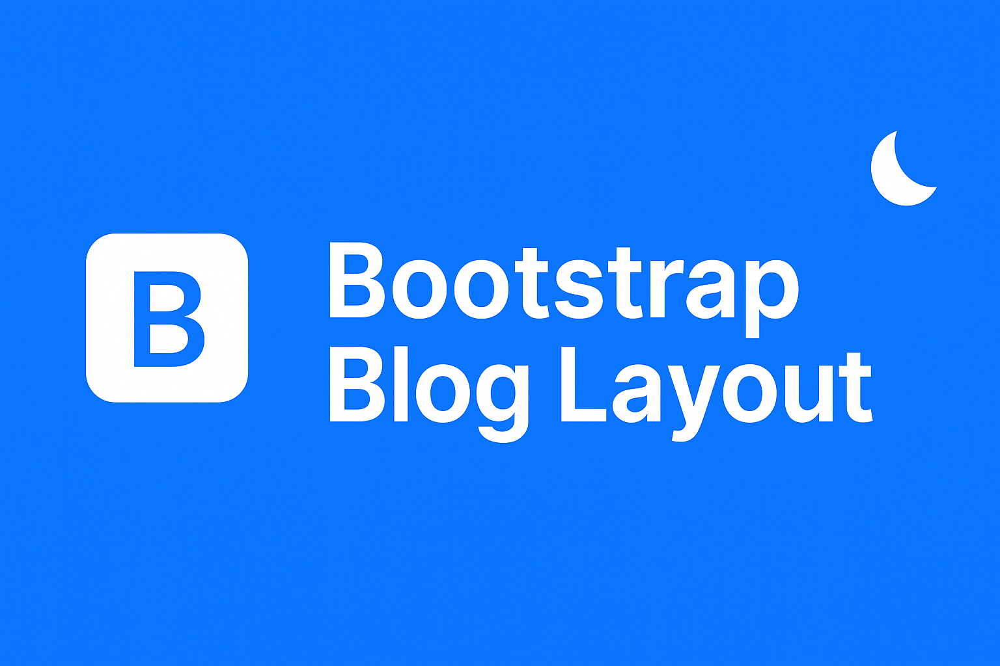
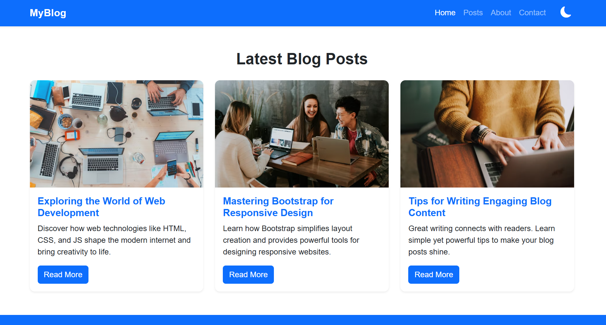
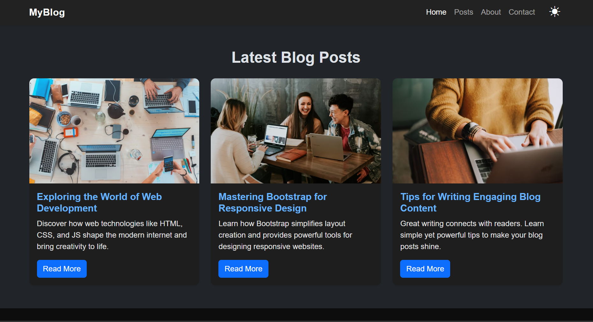

<p align="center">
  
</p>

<h1 align="center">📰 Bootstrap Blog Layout</h1>

<p align="center">
  A responsive blog layout built using <b>Bootstrap 5</b>, featuring a clean modern UI, 
  <b>light/dark mode toggle</b>, and <b>blog cards</b> with beautiful images.
</p>

<p align="center">
  This project was created as part of a <b>Web Development Internship Task</b> 
  to demonstrate understanding of <b>Bootstrap components</b>, 
  <b>grid system</b>, and <b>utility classes</b>.
</p>

---

## 🚀 Live Demo
🔗 [View on GitHub Pages](https://Deepu0808.github.io/Bootstrap-Blog-Layout/)

---

## 🎬 Preview
<p align="center">
  
</p>

<p align="center"><i>Light and Dark mode in action — a clean, responsive blog layout built with Bootstrap 5.</i></p>

---

## 🧠 Features

✅ Fully responsive layout using Bootstrap grid  
✅ Three stylish blog post cards with images, titles, and buttons  
✅ Smooth **Light/Dark Mode** toggle with persistent theme memory  
✅ Modern blue-based color palette with subtle hover effects  
✅ Footer with social media icons  
✅ Clean, accessible, and easy-to-read code  

---

## 🧩 Technologies Used

- **HTML5**
- **CSS3**
- **Bootstrap 5 (CDN)**
- **Bootstrap Icons**
- **JavaScript (for dark mode toggle)**

---

## 🎨 Color Palette

| Element | Light Mode | Dark Mode |
|----------|-------------|-----------|
| Primary | `#0d6efd` | `#66b3ff` |
| Background | `#f8f9fa` | `#121212` |
| Card Background | `#ffffff` | `#1e1e1e` |
| Footer | `#0d6efd` | `#0d0d0d` |
| Accent Hover | `#ffd43b` | `#ffd43b` |

---

## 📸 Screenshots

### 🌞 Light Mode


### 🌙 Dark Mode


---

## ⚙️ Setup Instructions

### 1️⃣ Clone the repository
```bash
git clone https://github.com/Deepu0808/Bootstrap-Blog-Layout.git

---


## 2️⃣ Open the folder
bash
Copy code
cd Bootstrap-Blog-Layout

---

## 3️⃣ Run the project
Open index.html in your browser.

🌗 Dark Mode
This project uses Bootstrap 5’s data-bs-theme feature for theme switching.
Click the toggle button 🌙 / ☀️ to instantly switch between light and dark mode.
Your preference is saved in localStorage, so it persists after refresh or reopening.

---

## 📁 Folder Structure
markdown
Copy code
Bootstrap-Blog-Layout/
│
├── index.html
├── style.css
├── script.js
├── banner.png
├── preview.gif
├── README.md
└── screenshots/
    ├── light-mode.png
    └── dark-mode.png

---

## 🏆 Learning Outcomes
Through this task, I learned to:

Use Bootstrap 5 CDN for rapid UI design

Work with Bootstrap’s grid system for responsive layouts

Implement cards, navbar, and footer components

Customize designs with utility classes and custom CSS

Add a dark mode toggle using JavaScript

---

## ✨ Credits
All images are from Unsplash and are free to use under their license:

Web Development: Photo by Brooke Cagle

Responsive Design: Photo by Tran Mau Tri Tam

Writing Blog: Photo by Thought Catalog

---

## 👩‍💻 Author
Deepika Lakshmi S
💼 Web Development Intern
📅 Task 8 – Bootstrap Blog Layout
📍 Created with ❤️ using Bootstrap 5

## 💬 Connect With Me
🌐 GitHub

💼 LinkedIn

✉️ Email: deepikalakshmis94@example.com


